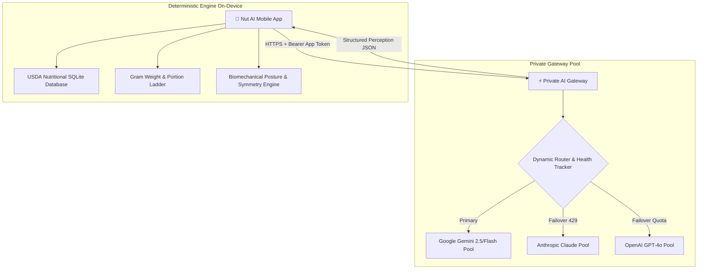

# 🥜 Nut AI — AI Nutrition Tracker & Biomechanical Body Companion

> **An open-source, private AI nutrition tracker and biomechanical posture coach that never shows a number it cannot justify.**

[](https://www.typescriptlang.org/)
[](https://reactnative.dev/)
[](https://render.com/)
[](LICENSE)

Nut AI unites two state-of-the-art perception engines into a single frictionless fitness companion:
1. **Zero-Friction AI Nutrition Tracker**: Point your camera at any meal to get calories and macros backed by honest uncertainty ranges, transparent assumptions, and deterministic USDA-grounded reconciliation.
2. **AI Body & Posture Biomechanical Scan**: Stand in front of your phone camera with live silhouette guides to receive instant posture alignment scoring, estimated body-fat percentage ranges, muscle symmetry analysis, and personalized corrective exercise protocols.

---

## 🌟 Key Features

### 1. 📸 Intelligent Food & Meal Perception
- **Component Decomposition**: Identifies each distinct food item separately (e.g. burger decomposes into patty, bun, and toppings rather than an unverified calorie blob).
- **Deterministic Reconciliation Ladder**: Portions and grams are calculated via packaged label data, discrete item counts, reference geometry, and USDA nutrition tables — **the AI model is purely a perception device and never invents ungrounded numbers**.
- **Five Camera Modes**:
  - 🥗 **Food Scan**: Full multi-item visual meal breakdown.
  - 🧍 **Body Scan**: Biomechanical posture, symmetry, and body composition estimation.
  - 🏷️ **Nutrition Label**: Direct verbatim optical transcription of printed nutrition panels.
  - 🧾 **Receipt Itemizer**: Line-item extraction linked to merchant nutritional databases.
  - 📊 **Barcode Scanner**: Zero-latency offline database matching.

---

### 2. 🧘 AI Body, Posture & Muscle Symmetry Scan
- **Live Silhouette Frame Guide**: Visual alignment markers for head, shoulders, torso, and pelvic positioning.
- **Hands-Free Countdown Timer**: 3s, 5s, or 10s timer triggers to let users step back and pose naturally.
- **Biomechanical Posture Score (0–100 Gauge)**: Evaluates forward head tilt, shoulder height asymmetry, rounded shoulders, and anterior/posterior pelvic tilt.
- **Estimated Body Composition**: Estimates realistic body-fat percentage ranges (e.g. 14%–17% Athletic) and muscular development ratings.
- **Muscle Symmetry & Balance**: Analyzes upper body, core/midsection, and lower body muscular balance.
- **Personalized Corrective Protocol**: Synthesizes 3 targeted corrective exercises and 2 mobility drills with form cues tailored specifically to each scan.

---

### 3. 🛡️ Zero-Client-Secrets Private Cloud Gateway
- **Multi-Provider Pool & Auto-Failover**: Rotates dynamically across Google Gemini, Anthropic Claude, and OpenAI resources with instant rate-limit (429) cooldowns and failover.
- **Client Security**: Mobile client APK contains zero API keys or vendor secrets. All communication is authenticated via lightweight app tokens over HTTPS.
- **Privacy-First Processing**: Photos are processed in-memory during inference and never permanently archived on external servers. All historical progress logs remain in local on-device SQLite.

---

## 🏗️ Architecture Overview



---

## 🚀 Quick Start Guide

### 1. Prerequisites
- **Node.js**: `v20.19.0` or later
- **npm**: `v10+`
- **Android Studio** (for local Android builds/emulators)

### 2. Installation
Clone the repository and install dependencies:
```bash
git clone https://github.com/Sarty-085/nut-ai-gateway.git
cd nut-ai-gateway
npm install
```

### 3. Configure Environment Variables
Copy `.env.example` to `.env` in the root folder:
```bash
cp .env.example .env
```
Fill in your provider API keys and access token:
```env
PORT=3000
HOST=0.0.0.0
APP_TOKENS=nuttoken1
ADMIN_TOKEN=supernut

# Google Gemini Key Pool
GOOGLE_API_KEY_1=AIzaSy...
MODEL_FOOD_ANALYSIS=gemini-flash-lite-latest

# Optional: Anthropic / OpenAI keys for pool failover
ANTHROPIC_API_KEY_1=sk-ant-...
OPENAI_API_KEY_1=sk-proj-...
```

### 4. Run the Private AI Gateway
```bash
# Start the local gateway service
npm run gateway:dev
```
Verify gateway health:
```bash
curl http://localhost:3000/v1/health
# Response: {"ok": true, "status": "online", "activeResources": 14}
```

### 5. Run the Mobile App
```bash
# Start Expo Metro bundler
npm --prefix apps/mobile run start

# Or compile and run directly on Android
npm --prefix apps/mobile run android
```

---

## ☁️ 2-Minute Cloud Deployment (Render / Railway)

### Deploy on [Render.com](https://render.com):
1. Create a **New Web Service** connected to your repository: `https://github.com/Sarty-085/nut-ai-gateway`.
2. Select **Docker** environment (a production-ready `Dockerfile` is included).
3. In **Environment Variables**, paste your `.env` variables (`APP_TOKENS`, `GOOGLE_API_KEY_1`, etc.).
4. Click **Deploy Web Service** to get your live HTTPS endpoint (e.g. `https://nut-ai-gateway.onrender.com`).

### Connect in Nut AI Mobile App:
1. Open **Nut AI** on your phone.
2. Navigate to **Profile** > **Private AI Gateway** > **Configure gateway connection**.
3. Set URL to your Render domain (`https://nut-ai-gateway.onrender.com`) and token to `nuttoken1`.

---

## 🧪 Testing & Quality Gates

Nut AI enforces strict quality gates across all 11 monorepo packages:

```bash
# Run full suite: ESLint + TypeScript + Vitest (345+ tests) + Node Purity + Data Verification
npm run check
```

- **Unit & Property Tests**: `npm test` (345/345 passing tests).
- **Typecheck**: `npm run typecheck` (strict TypeScript validation).
- **Node Purity Check**: `npm run check:node-purity` (ensures zero React Native contamination in core algorithms).
- **Golden Nutrition Queries**: `npm run data:verify` (26/26 benchmark USDA queries verified).

---

## 📦 Production Builds & Releases

Release APKs are available in the repository root and on GitHub Releases:
- **`nut-ai-v1.0.0.apk`**: Stable baseline with AI Food, Nutrition Label, Barcode, and Receipt scanning.
- **`nut-ai-body-scan-v1.1.0.apk`**: Latest version featuring the **AI Body & Posture Biomechanical Scan**.

---

## 👥 Adding Collaborators & Team Members

To give team members push access or project permissions on GitHub:
1. Go to your repository on GitHub: **[https://github.com/Sarty-085/nut-ai-gateway](https://github.com/Sarty-085/nut-ai-gateway)**.
2. Click **Settings** (gear icon in the top navigation bar).
3. In the left sidebar, click **Collaborators** under "Access".
4. Click the green **"Add people"** button.
5. Enter your teammate's GitHub username or email address and select their permission level (**Write** or **Admin**).
6. Send the invitation — once accepted, they will have full collaborator access to push branches and deploy updates!

---

## 📄 License
This project is licensed under the **AGPL-3.0 License**.
