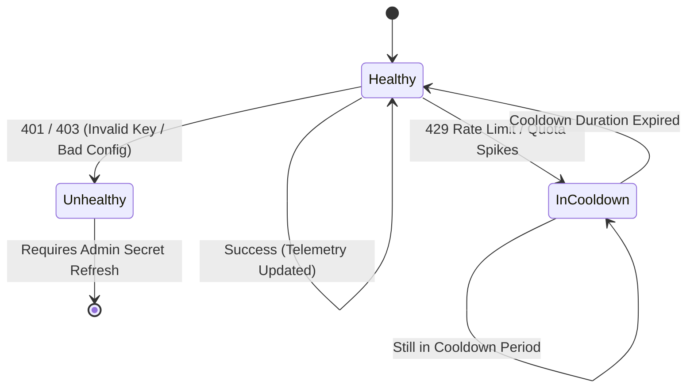

# Nut AI Private AI Gateway & Provider Resource Pool

This document details the architecture, configuration, routing algorithm, security guarantees, and deployment models for the **Nut AI Private AI Gateway** service (`apps/gateway`).

---

## 1. Architectural Principles

### 1.1 The AI is Strictly a Perception Layer
Nut AI enforces a hard separation of concerns between statistical perception and deterministic computation:
- **Perception Layer (AI Gateway)**:
  - Identifies food items, visually estimated portions (e.g. `medium apple`, `1 cup cooked rice`), food state descriptions, nutrition facts label OCR, and receipt line items.
  - Outputs normalized JSON adhering strictly to schemas defined in `@nutai/core-schema` (`VisionPayloadZ`, `LabelPayloadZ`, `ReceiptPayloadZ`, `WebLookupResultZ`, `ExerciseEstimateZ`).
- **Deterministic Computation Engine (Mobile Local Engine)**:
  - Matches recognized foods against the bundled 7,900+ item USDA FoodData Central SQLite database (`packages/resolver`).
  - Scales density-based volume-to-gram weights via verified density tables (`packages/gram-engine`).
  - Computes exact energy and macronutrient breakdowns (`packages/totals`).
  - Quantifies measurement uncertainty and bounds (`packages/confidence`).
  - Computes nutrition goals, BMR, TDEE, and adaptive caloric adjustments (`packages/goals`).
  - Generates transparent, verifiable repair cards for missing or ambiguous items (`packages/repair`).

**The AI NEVER invents numbers or calculates nutrition totals directly.**

### 1.2 Zero Secrets on Mobile
- No Anthropic, Google, or OpenAI API keys are stored in the Android APK, React Native bundle, Expo config, SQLite, AsyncStorage, or SecureStore.
- The mobile application only holds an application access token (`APP_TOKEN`) and the gateway endpoint URL (`GATEWAY_URL`).
- Application access tokens are revocable without updating client binary builds.

### 1.3 Authentication Separation
- **Normal Client Access (`/v1/analyze`, `/v1/label-scan`, etc.)**:
  - Requires `Authorization: Bearer <APP_TOKEN>` or `x-nutai-app-token: <APP_TOKEN>`.
  - Scoped only to user perception tasks.
- **Administrator Access (`/v1/admin/*`)**:
  - Requires `Authorization: Bearer <ADMIN_TOKEN>` or `x-admin-token: <ADMIN_TOKEN>`.
  - Grants access to resource pool telemetry, health metrics, and token revocation.
  - **Provider secrets are NEVER transmitted over the wire or included in admin responses.**

---

## 2. Gateway Capabilities & Task Routing

The gateway router manages an internal capability matrix across all configured provider resources:

| Task Type | Route | Supported Providers | Payload Structure |
| :--- | :--- | :--- | :--- |
| `food-analysis` | `POST /v1/analyze` | Google, Anthropic, OpenAI | Base64 images + meal context |
| `label-scan` | `POST /v1/label-scan` | Google, Anthropic, OpenAI | Nutrition facts panel image |
| `receipt-scan` | `POST /v1/receipt-scan` | Google, Anthropic, OpenAI | Itemized receipt image |
| `web-lookup` | `POST /v1/web-lookup` | Google, Anthropic, OpenAI | Food query + brand context |
| `exercise-estimate` | `POST /v1/exercise-estimate` | Google, Anthropic, OpenAI | Workout description + weight |

### 2.1 Provider Capability Matrix

Before routing a request, the router filters the pool by:
1. `resource.enabled === true`
2. `resource.healthState !== 'unhealthy'` (resources with authentication or configuration errors are isolated)
3. `resource.capabilities.includes(task)`
4. Cooldown expiration (resources in `cooldown` whose cooldown timestamp has passed are automatically recovered to `healthy`)

---

## 3. Resilience, Cooldown & Anti-Naive Failover

The gateway avoids naive round-robin loops. Instead, it follows a structured state machine:



### 3.1 Failure Handling Rules
1. **Success (200 OK)**:
   - Returns normalized payload immediately.
   - Updates telemetry (`totalRequests`, `totalSuccesses`, `lastSuccessAt`, `averageLatencyMs`).
2. **Transient Network Failure / 5xx**:
   - Performs bounded retry (up to `MAX_RETRIES` with exponential backoff `200ms`, `400ms`).
   - If retries fail, fails over to the next eligible resource in priority order.
3. **Rate Limit / Quota (429 / 402 / RESOURCE_EXHAUSTED)**:
   - Respects upstream `Retry-After` header if present; otherwise applies default cooldown (`COOLDOWN_MS`, default 60s).
   - Marks resource `healthState = 'cooldown'`.
   - Fails over immediately to the next compatible healthy resource in the pool.
4. **Authentication Error (401 / 403 / INVALID_ARGUMENT key error)**:
   - Marks resource `healthState = 'unhealthy'` with `lastErrorReason = 'Authentication failed'`.
   - **Does not loop or retry against bad credentials.**
   - Fails over to remaining healthy resources.
5. **Schema Violation / Malformed Output**:
   - Retries once with strict output formatting instructions. If failed, selects alternative provider adapter.
6. **All Resources Exhausted**:
   - Returns clean error response (`503 Service Unavailable` with `NO_ELIGIBLE_RESOURCE` error code and user-friendly explanation).

---

## 4. Usage Protection & Rate Limiting

The gateway features built-in sliding-window rate limiters and financial ceiling checks:

- **Per-Token Per-Minute Limit**: Limits bursts from individual devices/tokens (`RATE_LIMIT_PER_MINUTE`, default 60 req/min).
- **Per-Token Daily Limit**: Limits daily quota per device (`RATE_LIMIT_DAILY`, default 1,000 req/day).
- **Global Gateway Per-Minute Limit**: Protects the gateway service from DDoS (`RATE_LIMIT_GLOBAL_PER_MINUTE`, default 300 req/min).
- **Daily Budget Ceiling (`DAILY_COST_CAP_USD`)**: Optional dollar amount cap. The rate limiter tracks cumulative estimated USD token costs; once the daily cap is exceeded, all non-admin requests are safely refused until daily reset.

---

## 5. Request Deduplication & In-Flight Sharing

To eliminate duplicate billing and double upstream API requests caused by user double-taps:
- Generates a SHA-256 fingerprint of `(task, payload)` or uses the optional `Idempotency-Key` header.
- **In-flight Sharing**: If a second request arrives while the first request is still resolving upstream, both requests share the exact same Promise execution.
- **Result Caching Window**: Cached results are retained for `DEDUP_WINDOW_MS` (default 5,000ms).

---

## 6. Deployment & Operations

### 6.1 Running with Node.js
```bash
# Build the gateway
npm run gateway:build

# Start the gateway
npm run gateway:start
```

### 6.2 Running in Development
```bash
npm run gateway:dev
```

### 6.3 Docker Deployment
```dockerfile
FROM node:20-alpine AS builder
WORKDIR /app
COPY . .
RUN npm ci
RUN npm run gateway:build

FROM node:20-alpine AS runner
WORKDIR /app
ENV NODE_ENV=production
COPY package*.json ./
COPY apps/gateway/package.json ./apps/gateway/
COPY packages ./packages
COPY apps/gateway/dist ./apps/gateway/dist
RUN npm ci --omit=dev

EXPOSE 3000
CMD ["node", "apps/gateway/dist/index.js"]
```

---

## 7. HTTP API Reference

### 7.1 Client Endpoints

#### `POST /v1/analyze`
Analyzes meal photos and returns structured food perceptions.
- **Headers**: `Authorization: Bearer <APP_TOKEN>`, `Content-Type: application/json`
- **Body**:
  ```json
  {
    "imagesBase64": ["<base64-jpeg-string>"],
    "localSignalsBlock": "",
    "fixBlock": "",
    "keepFraction": 1.0
  }
  ```
- **Response (200 OK)**:
  ```json
  {
    "ok": true,
    "data": {
      "schema_version": "1.0.0",
      "is_food": true,
      "items": [
        {
          "name": "grilled chicken breast",
          "portion_description": "1 palm-sized breast",
          "estimated_grams": 150,
          "confidence": 0.85
        }
      ]
    },
    "meta": {
      "provider": "google",
      "model": "gemini-2.5-flash",
      "resourceId": "google-01",
      "inputTokens": 450,
      "outputTokens": 110,
      "costUsd": 0.00015,
      "latencyMs": 420
    }
  }
  ```

#### `POST /v1/label-scan`
Extracts structured nutrition facts from a packaged food label photo.
- **Body**: `{ "imageBase64": "<base64-string>" }`
- **Response**: `{ "ok": true, "data": { "product_name": "Greek Yogurt", "serving_g": 150, "per_serving": { "calories_kcal": 100, "protein_g": 15, "fat_g": 0, "carbs_g": 5 } } }`

#### `POST /v1/receipt-scan`
Transcribes meal and line items from a dining receipt.
- **Body**: `{ "imageBase64": "<base64-string>" }`

#### `POST /v1/web-lookup`
Queries online nutrition sources for branded or menu items.
- **Body**: `{ "itemName": "Chicken Sandwich", "brand": "Popeyes" }`

#### `POST /v1/exercise-estimate`
Estimates MET, duration, and energy expenditure from a text description.
- **Body**: `{ "description": "30 minutes moderate swimming", "weightKg": 75 }`

#### `GET /v1/health`
Public health status check (unauthenticated).
- **Response**:
  ```json
  {
    "ok": true,
    "status": "online",
    "activeResources": 3,
    "totalResources": 3,
    "version": "1.0.0",
    "timestamp": 1771164000000
  }
  ```

---

### 7.2 Administrator Endpoints

#### `GET /v1/admin/status`
Returns full pool health, load metrics, and masked resource telemetry.
- **Headers**: `Authorization: Bearer <ADMIN_TOKEN>`
- **Response**:
  ```json
  {
    "ok": true,
    "activeResources": 3,
    "rateLimits": {
      "activeTokens": 12,
      "globalRequestsLastMinute": 4,
      "dailyTotalCostUsd": 0.042
    },
    "telemetry": [
      {
        "id": "google-01",
        "provider": "google",
        "priority": 1,
        "healthState": "healthy",
        "totalRequests": 128,
        "totalSuccesses": 128,
        "totalFailures": 0,
        "totalFailovers": 0,
        "lastSuccessAt": 1771163990000,
        "averageLatencyMs": 385
      }
    ]
  }
  ```

#### `POST /v1/admin/tokens/revoke`
Revokes an application token instantly.
- **Headers**: `Authorization: Bearer <ADMIN_TOKEN>`
- **Body**: `{ "token": "compromised-token-id" }`
